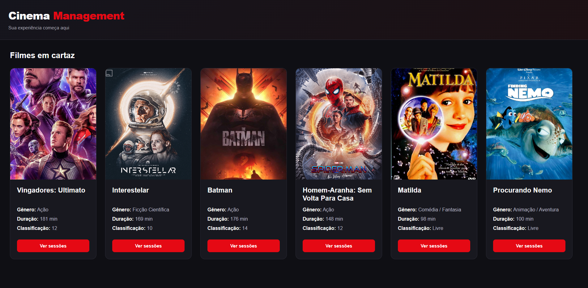
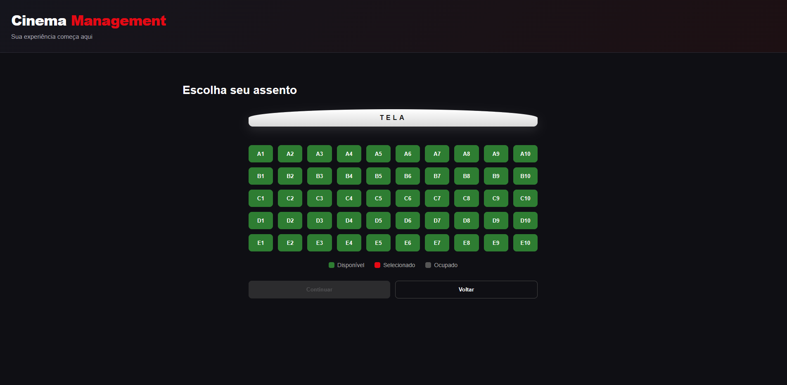
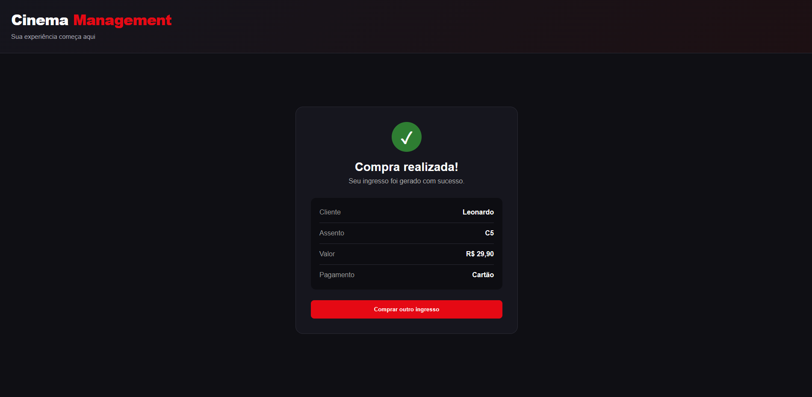

# Cinema Management 🎬

Projeto de um sistema de cinema desenvolvido com C# e ASP.NET Core.

A ideia foi criar um fluxo completo de compra de ingresso, desde a escolha do filme até a confirmação da compra.

## Sobre o projeto

No sistema é possível visualizar os filmes em cartaz, escolher uma sessão, selecionar um assento e informar os dados do cliente para realizar a compra.

Também trabalhei algumas regras no backend, como impedir a venda de um assento que já está ocupado e validar os dados enviados pelo usuário.

## Imagens

### Filmes em cartaz



### Seleção de assentos



### Compra realizada



## Funcionalidades

- Listagem de filmes
- Sessões por filme
- Seleção de assentos
- Assentos disponíveis e ocupados
- Cadastro de clientes
- Compra de ingressos
- Validação dos dados do cliente
- Validações no backend
- Layout responsivo

## Tecnologias

**Backend**
- C#
- ASP.NET Core
- Entity Framework Core
- MySQL

**Frontend**
- HTML
- CSS
- JavaScript

**Outras ferramentas**
- Swagger
- Git
- GitHub

## Algumas coisas que trabalhei no backend

Uma das regras do sistema é impedir que o mesmo assento seja vendido duas vezes para a mesma sessão.

Também fiz o preço do ingresso ser definido pelo próprio backend. Mesmo que outro valor seja enviado pela requisição, o sistema utiliza o preço cadastrado na sessão.

No cadastro de clientes, o backend também valida informações como nome, e-mail, telefone e data de nascimento.

## Estrutura

Separei o backend em:

- Controllers
- Services
- DTOs
- Models
- Data

Os Controllers recebem as requisições e os Services concentram boa parte das regras do sistema.

## Como rodar

Para executar o projeto é necessário ter o .NET e o MySQL instalados.

Clone o repositório:

```bash
git clone https://github.com/Leonardo6717/CinemaManagement.git
```

Entre na pasta:

```bash
cd CinemaManagement
```

Restaure os pacotes:

```bash
dotnet restore
```

Configure a conexão com o MySQL e aplique as migrations:

```bash
dotnet ef database update
```

Depois execute:

```bash
dotnet run
```

A API também pode ser testada pelo Swagger.

## O que usei/pratiquei

Esse projeto me ajudou a praticar:

- API REST com ASP.NET Core
- Entity Framework Core
- MySQL
- DTOs
- Services e Controllers
- Validações no frontend e backend
- `async/await`
- Fetch API
- Git e GitHub

## Autor

Leonardo M. S. Souza